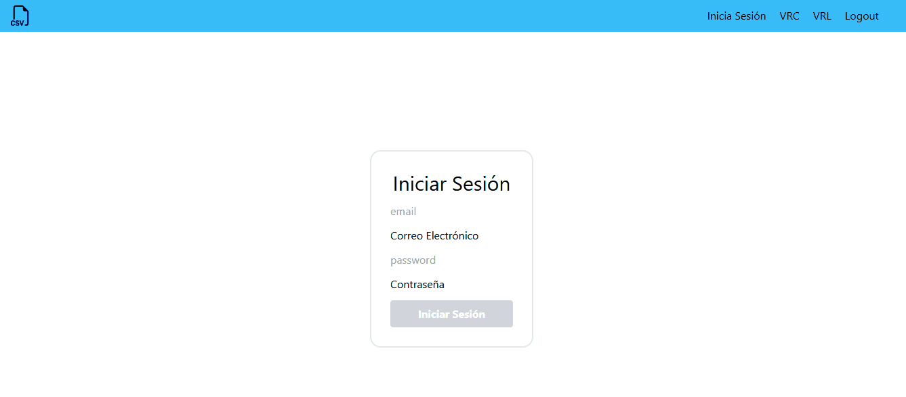

# SISTEMA DE CARGA DE DATOS
## _Este proyecto es una aplicación de autenticación de usuario que permite el acceso a una página principal solo si se ingresan las credenciales correctas. Además, la aplicación permite a los usuarios con rol de **administrador** cargar archivos CSV con datos de usuarios como nombre, correo electrónico y edad._

## Características

- **Login seguro**: acceso a la página principal mediante ingreso de usuario y contraseña.
- **Rol de administrador**: los administradores tienen permisos especiales para cargar archivos CSV.
- **Carga de archivos CSV**: permite cargar archivos CSV con datos de usuarios (nombre, correo electrónico y edad).
- **Validación de datos**: verifica que los datos del CSV estén correctamente estructurados antes de ser cargados.
## Instalación

Sigue estos pasos para clonar el repositorio e instalar las dependencias del proyecto.

1. **Clona el repositorio:**

   ```bash
   git git@github.com:juan-arango35/reto-tecnico.git
   cd reto-tecnico
   npm install
   npm run dev

## Proceso
- **Login seguro**: Inicia sesión con el usuario que tenga rol de admin, sino cuenta con el email y  contraseña valido nos da el error de credenciales invalidas,  El usuario admin puede acceder a todas las rutas de la aplicación.
<p style="text-align: center;">

</p>
- **Navegación**: En el header de navegación, puedes encontrar enlaces que muestran respuestas simuladas del login, esta muestra la respuesta simulada del login.
  
- **Carga de datos CSV:**: En la página principal muestra un input tipo file, donde se pueden cargar los archivos de csv.
  
- **Validación de Datos**: La aplicación verifica qué registros cumplen con las condiciones establecidas. Los registros válidos se guardan, y aquellos que no cumplen con los requisitos se muestran para intentar corregir.

- **Corrección y reenvío de datos**: Puedes corregir los registros no válidos mediante un input en la interfaz e intentar enviarlos de nuevo para validación.

  ## Tecnologías Usadas

- **React**: desarrollo de la interfaz de usuario.
- **Vite**: herramienta de desarrollo rápida y ligera para el empaquetado de la aplicación.
- **Tailwind CSS**: estilización rápida y modular.
- **Vitest**: pruebas de la aplicación.
- **React Router DOM**: manejo de rutas en la aplicación.
- **React Icons**: iconos personalizados para mejorar la experiencia visual.
  
## Agradecimientos

  Queremos agradecer a todos aquellos que han contribuido con su tiempo y apoyo a este proyecto, ya sea con retroalimentación, pruebas o aportes técnicos. Gracias por ayudar a hacer que este proyecto cobre vida.

## Estado del Proyecto

Este proyecto aún se encuentra en proceso de culminación. Próximas mejoras y funcionalidades adicionales están en desarrollo para optimizar la experiencia del usuario y asegurar un sistema robusto.
